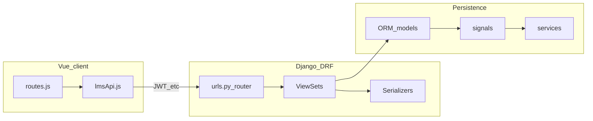

# Архитектура модуля LMS

## Слои

1. **Представление (Vue)** — страницы под `/lms`, общий layout, вызовы HTTP через `apiClient` и обёртку `lmsApi`.
2. **HTTP API** — Django REST Framework, префикс **`/api/lms/`** (см. раздел URL в [03-integration-core.md](03-integration-core.md)).
3. **Домен** — модели ORM в `models.py`, бизнес-правила в ViewSet (`perform_create`, `get_queryset`), частично в сервисах.
4. **Побочные эффекты** — `signals.py`: уведомления, календарь, синхронизация `LessonItem`, значки.
5. **Сервисы** — `services.py`: уведомления, значки, прогресс, календарь, оценивание, отчёты (часть методов может вызываться из сигналов или ViewSet).

## Поток типового сценария «студент открывает курс»

1. Клиент запрашивает список записей: `GET /api/lms/enrollments/` (только свои записи).
2. Для структуры курса: `GET /api/lms/subjects/{id}/structure/` — курс + дерево тем и уроков (см. `SubjectViewSet.structure`).
3. Элементы урока: `GET /api/lms/lesson-items/by-lesson/?lesson_id=...`.

## Монолитность серверного слоя

Основная логика REST сосредоточена в одном файле [api/views.py](../api/views.py). Вложенные пакеты `courses`, `assignments`, `users` содержат альтернативные/исторические маршруты (см. [09-nested-apps.md](09-nested-apps.md)).

## Медиа и файлы

Загрузки используют `FileField` / `ImageField` с префиксами `upload_to` (аватары, изображения курса, ресурсы, значки). Раздача в продакшене зависит от настроек статики/медиа ядра, не от текста этого модуля.
